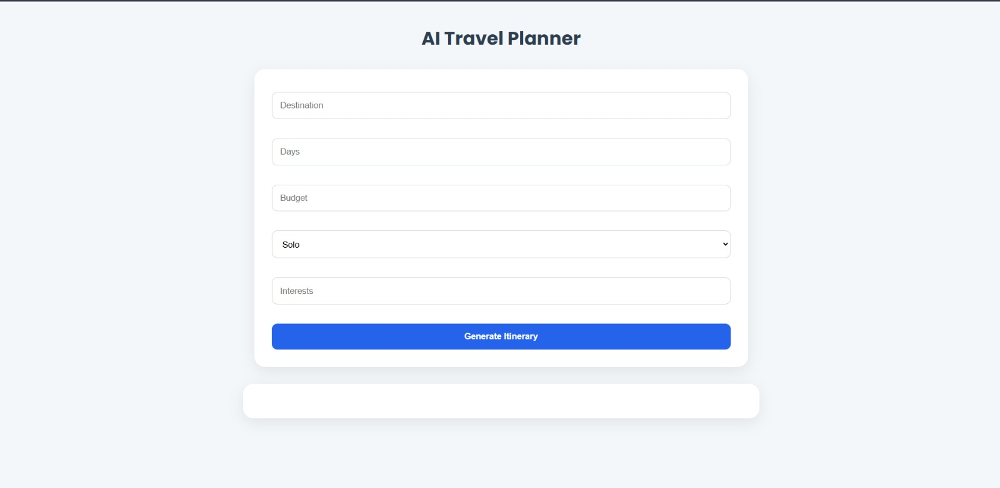
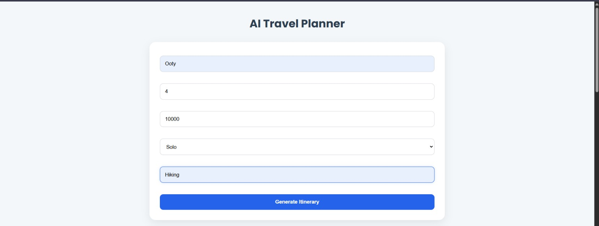
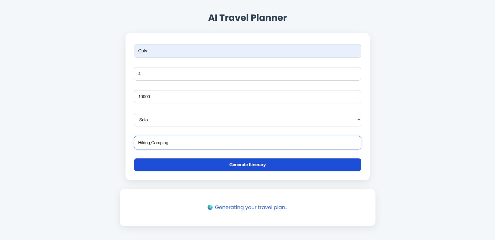
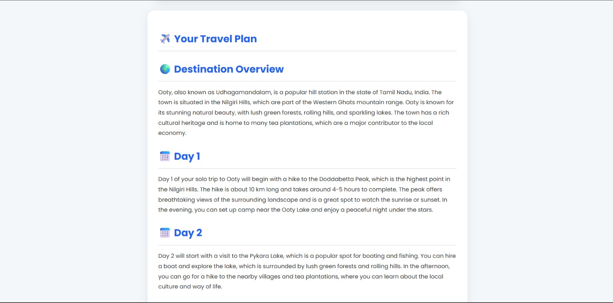
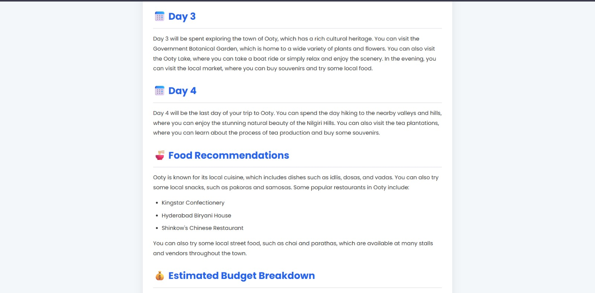
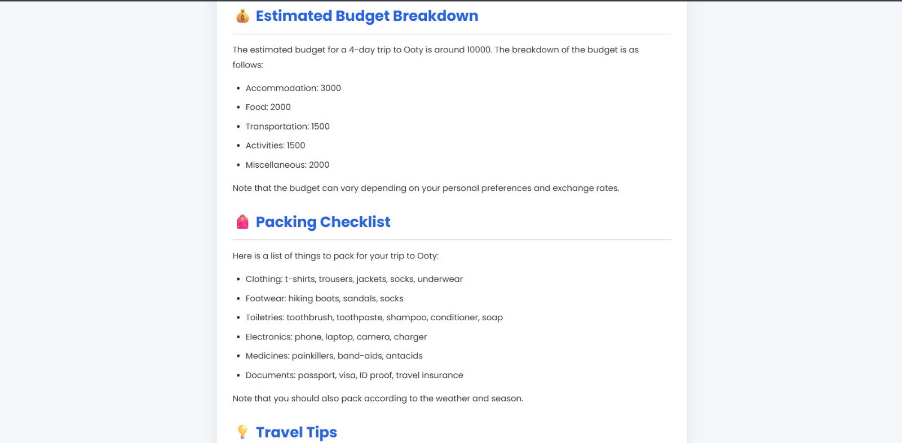

# AI Travel Planner

An AI-powered travel planning web application built using Python and Groq LLM API.

# AI Travel Planner

Live Demo:
https://ai-travel-planner-0ykd.onrender.com

# AI Travel Planner

## Home Page

## User Input Form

## Generated Itinerary

## Features

- Generates travel itineraries
- Takes:
  - Destination
  - Budget
  - Number of people
  - Number of days
  - Interests
- Uses Groq LLM API
- Web-based interface
- Interest-based recommendations
- Multi-day travel schedules

## Tech Stack
- Python
- Flask
- Groq API
- HTML/CSS
- JavaScript
- Git & GitHub
- Render

## Setup

pip install -r requirements.txt

python app.py

